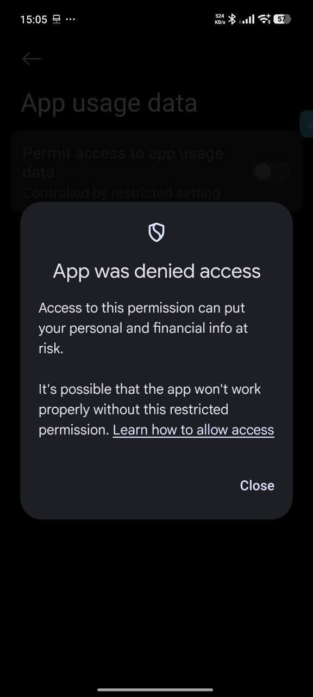
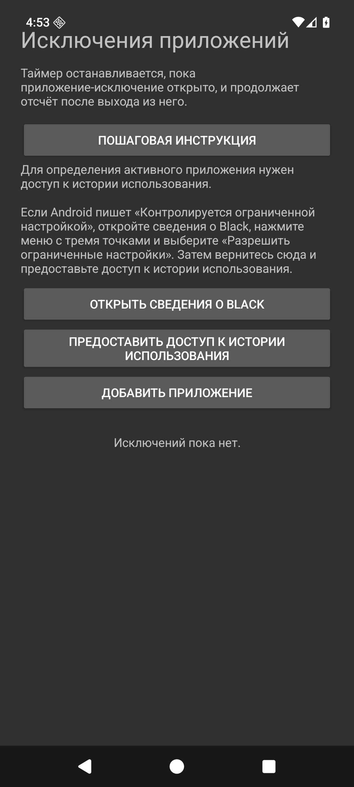
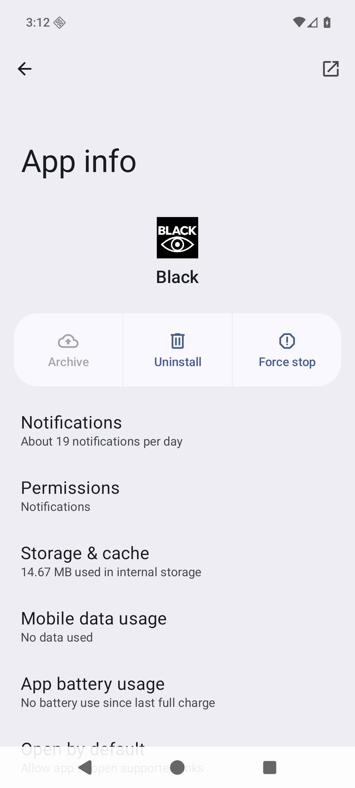
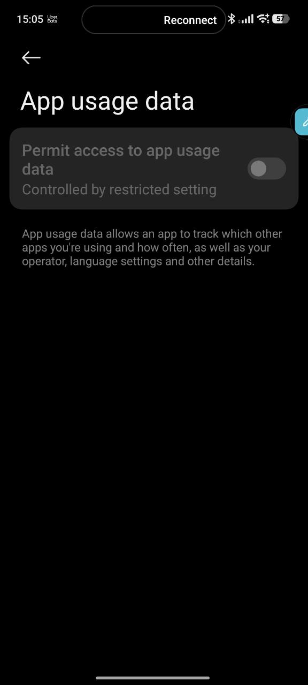
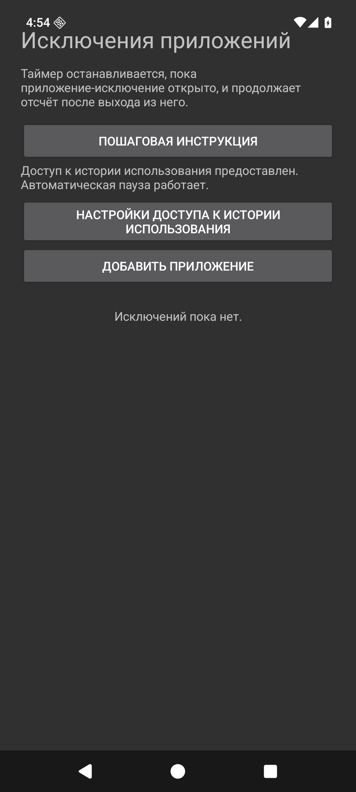

# Как включить исключения приложений

Black ставит таймер на паузу, пока открыто приложение из списка исключений. Для этого Android должен разрешить Black доступ к истории использования приложений. На телефоне с установленным вручную APK Android может сначала потребовать подтверждение **«Разрешить ограниченные настройки»**.

## Шаг 1. Узнайте, что доступ заблокирован

Если появляется окно **«App was denied access»** или переключатель помечен **«Controlled by restricted setting»**, пока не пытайтесь включать его повторно.

## Шаг 2. Откройте сведения о Black

В Black откройте **«Исключения приложений»** и нажмите **«Открыть сведения о Black»**.

## Шаг 3. Разрешите ограниченные настройки

На странице **«Сведения о приложении»** откройте меню **⋮** в правом верхнем углу и выберите **«Разрешить ограниченные настройки»**. При необходимости подтвердите действие кодом разблокировки. На снимке показана страница сведений в эмуляторе; меню появляется на устройстве, где Android ограничил установленный APK.

## Шаг 4. Включите доступ к истории использования

Вернитесь в Black и нажмите **«Предоставить доступ к истории использования»**. Выберите Black и включите переключатель **«Разрешить доступ к данным об использовании приложений»**. На снимке ниже он ещё заблокирован, до подтверждения шага 3.

## Шаг 5. Проверьте результат

Вернитесь в **«Исключения приложений»**. Должно появиться сообщение **«Доступ к истории использования предоставлен. Автоматическая пауза работает.»** Теперь можно нажать **«Добавить приложение»**.

Названия пунктов Android могут отличаться в зависимости от производителя телефона и языка системы. Подтверждение ограниченных настроек выполняется только в настройках Android; Black не может включить его самостоятельно.
